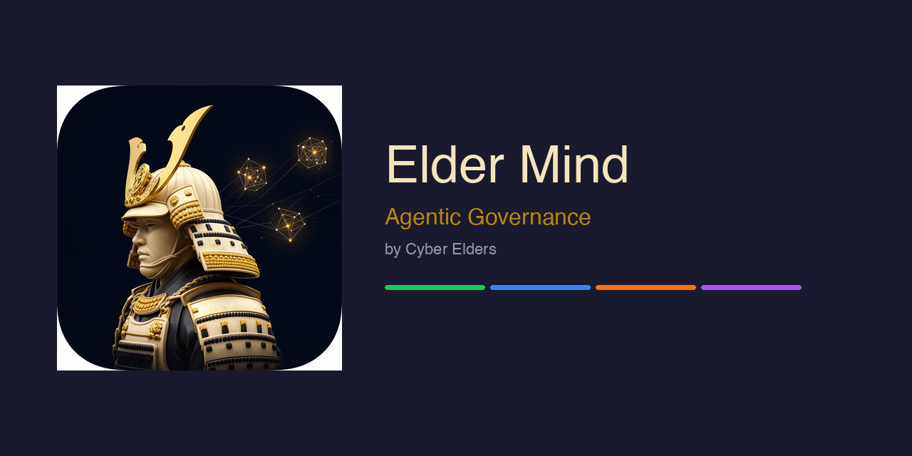

  

<h1 align="center">Cyber Elders</h1>

<b>A pause before your AI agents act — from your machine to your organisation.</b>

  
  
  
  

---

## The problem

Your AI coding agent now *acts on its own* — running commands, editing files, installing packages, pushing to git — faster than you can read along. Most of the time that's a superpower. But it takes one bad call — a stray `rm -rf`, a force-push, a leaked `.env`, a poisoned package — and the damage is done. At org scale, a *fleet* of agents multiplies that risk with no central control.

## What we build — **Elder Mind**

Elder Mind puts a wise elder's *pause before you act* into AI agents, at two scales — sharing one decision engine, guided by one methodology.

| | Product | For | What it does |
|---|---|---|---|
| 🛡️ | **[elder-mind-harness](https://github.com/Cyber-Elders/elder-mind-harness)** | individual devs & teams | A local gate inside your coding agent (Claude Code / OpenCode / Kiro). Before a risky tool call runs, it scores it, decides **allow / warn / ask / block** in plain language, and logs it — on *your* machine, with *your* model, no cloud. |
| 🏛️ | **Elder Mind backend** *(in the works)* | larger organisations | A control plane: credential & policy gating, plus governance and assurance across a *fleet* of agents — central audit, escalation, and supply-chain curation. |
| 📜 | **[elder-mind](https://github.com/Cyber-Elders/elder-mind) — the methodology** | everyone | The rulebook: principles, the coined ideas, and an honest standards crosswalk. |

**They work alone *or* together:** the harness is the *edge*, the backend is the *control plane*, and the harness can report up to it. Neither requires the other.

## Honest by design

We say what our tools do **not** do. Elder Mind *reduces* risk; it doesn't eliminate it — a high-signal tripwire at the moment of action, not a sandbox or a guarantee. We keep claims at "**aware**" / "**aligned**", never "compliant" or "certified" — and we enforce that in CI.

## What's new about it

Most AI-safety tooling filters *text* (prompts/outputs) or governs *deployed* workloads. Elder Mind governs **the action** — the exact moment an agent is about to run a command, touch a secret, or install a package. That runtime, *moment-of-action* enforcement — especially for the **agentic supply chain** (OWASP **ASI04**: poisoned installs, tool "rug-pulls") — is where the harm actually happens.

## Start here

- 🛡️ **Try the harness** → [`Cyber-Elders/elder-mind-harness`](https://github.com/Cyber-Elders/elder-mind-harness)
- 📜 **Read the idea + the model** → [`Cyber-Elders/elder-mind`](https://github.com/Cyber-Elders/elder-mind)

---

© 2026 Cyber Elders Pty Ltd · Code under Apache-2.0 · Docs under CC BY 4.0 · Built to be honest about its limits.
